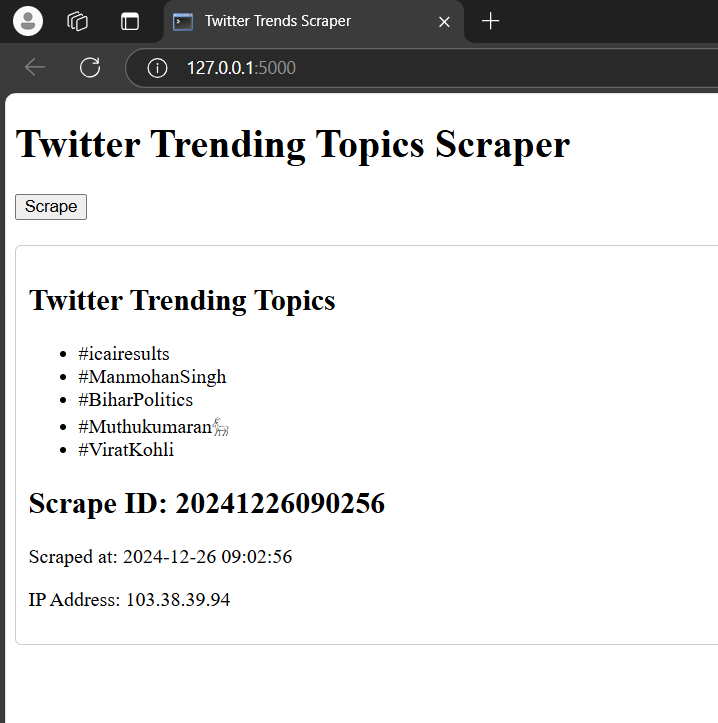

# Twitter scraper for latest trends

## Technologies

- Python
- Selenium
- MongoDB

## Output



## How to run

1. Git clone the repository
2. Install the requirements

```
pip install -r requirements.txt
```

3. Run the script

```

# if linux or mac

gunicorn wsgi:app

# if windows

python main.py

```
